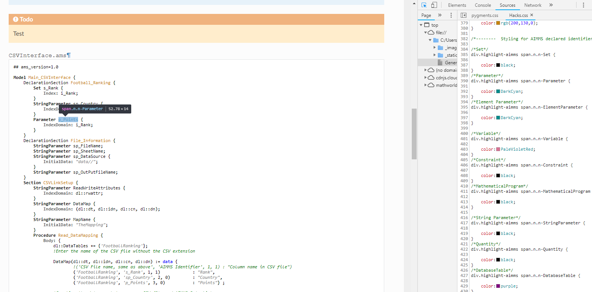
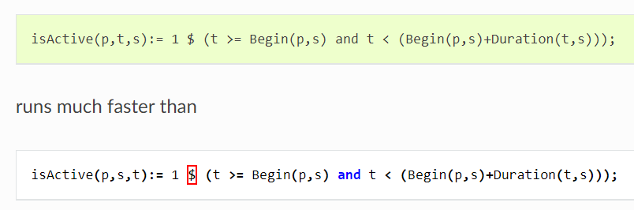

AIMMS Lexer - Syntax highlighter
------------------------------------


an **AIMMS [pygment lexer](http://pygments.org/)** to highlight your AIMMS [code blocks in sphinx](http://www.sphinx-doc.org/en/master/usage/restructuredtext/directives.html#directive-code-block) 


Intro
---------

The AIMMS lexer is meant to highlight any aimms code block in our RST files, according to AIMMS procedure script IDE. It supports AMS files as well, i.e. **[Text representation](https://community.aimms.com/aimms-developer-12/text-representation-vs-what-to-put-in-the-aimms-gui-165)** of an AIMMS model.

To use is it, you should use the `code-block` directive, as follows:

```
.. code-block:: aimms

    P_Demand(i) := Uniform(1,200)
```

See an example [here](https://how-to.aimms.com/Articles/132/132-Repetive-Patterns-Model-Edit.html) 

Currently supported prefixes and their colors (**case insensitive**)
-------------------------------------------------------------------

| Prefix   | Type                 | Coloring       |
|----------|----------------------|----------------|
| P_       | Parameter            | DarkCyan       |
| P01_     | Parameter            | DarkCyan       |
| EP_      | ElementParameter     | DarkCyan       |
| S_       | Set                  | black          |
| Cal_     | Set                  | black          |
| SP_      | StringParameter      | black          |
| V_       | Variable             | PaleVioletRed  |
| V01_     | Variable (binary)    | PaleVioletRed  |
| EV_      | ElementVariable      | PaleVioletRed  |
| C_       | Constraint           | black          |
| MP_      | MathematicalProgram  | black          |
| DBT_     | DatabaseTable        | black          |
| PR_      | Procedure            | black          |
| CNV_     | Convention           | black          |
| I_       | Index                | black          |

Current supported Types and their associated color (based on AIMMS color IDE)
-----------------------------------------------------------------------------
| Priority | Type                        | Coloring            |
|----------|-----------------------------|---------------------|
| 1        | Comment in procedure        | green               |
| 2        | Comment in Attribute Window | green               |
| 3        | AllKeywords (if,then..)     | blue                |
| 4        | AllPredeclaredIdentifiers   | brown               |
| 5        | String ("")                 | gray                |
| 6        | Element ('')                | gray                |
| 7        | AllIntrinsicFunctions       | brown               |
| 8        | Identifier prefix           | various (see above) |

How-To customize Highlighted colors
--------------------------------------

For now on, colors are defined in the [aimms-theme.css file](../sphinx_aimms_theme/static/aimms-theme.css). You may scroll down till the end of the file, and see the basic css there.

Please be aware that modifying the CSS file might not be reflected to all repos, because browsers sometimes use cached css files if the name of the css isn't changed. 
Please try to change the css file name when making a change to it, like appending the date for example:

``aimms-theme-20191211.css``



Current types that are "supported"
-----------------------------------
If you look at the bottom of the aimms-theme.css file, you should see something like:
``` css
/*--------  Styling for AIMMS declared identifier name by type (see AIMMS PowerPoint colour palette) --------------*/

/*Set*/
div.highlight-aimms span.n.n-Set {color:black;}
/*Parameter*/
div.highlight-aimms span.n.n-Parameter {color:DarkCyan;}
/*Element Parameter*/
div.highlight-aimms span.n.n-ElementParameter {color:DarkCyan;}
/*Variable*/
div.highlight-aimms span.n.n-Variable {color:PaleVioletRed;}
/*Constraint*/
div.highlight-aimms span.n.n-Constraint {color:black;}
/*MathematicalProgram*/
div.highlight-aimms span.n.n-MathematicalProgram {color:black;}
/*String Parameter*/
div.highlight-aimms span.n.n-StringParameter {color:black;  }
/*Quantity*/
div.highlight-aimms span.n.n-Quantity {color:black;}
/*DatabaseTable*/
div.highlight-aimms span.n.n-DatabaseTable {color:purple;}
/*Index*/
div.highlight-aimms span.n.n-Index {color:black;}
/*Convention*/
div.highlight-aimms span.n.n-Convention {color:black;}
```


As you can see, this CSS is referring to some particular class (css selector), for example ``n.n-Parameter``. Since it is CSS styling, you can inspect your file directly in the browser to see which selector are used (as in AIMMS WebUI):

Current types that are recognized and passed to the HTML are the following:
* Parameter as `n.n-Parameter`
* ElementParameter `n.n-ElementParameter `
* Set `n.n-Set`
* StringParameter `n.n-StringParameter`
* Variable `n.n-Variable`
* Constraint `n.n-Constraint`
* MathematicalProgram `n.n-MathematicalProgram `
* DatabaseTable `n.n-DatabaseTable`

Default rules used to highlight text
-------------------------------------

Everything happens in the file ``aimms.py``, located in `_static/AIMMSLexer/Lexer/aimms.py`. I will describe it from top to bottom. 

This syntax highlighter is using regular expressions. In this file, we have several regular expression rules, one after another that will detect words, and return the corresponding type (used to show a style,color,font). 

**As soon as a regular expression is valid (that there is a match), the procedure breaks (exit) and returns the found match type.** This logic enables us to describe the process as follows:

If the text is a comment single line, multiline, inside a procedure or in a comment block of any attribute window:

> The text is green. 

if not, Sphinx checks if it is an AIMMS keyword (blue type,  like `if` or `then` )

> the text is blue

etc. ...

The priority list is thus as above:

| Priority | Type                        | Coloring            |
|----------|-----------------------------|---------------------|
| 1        | Comment in procedure        | green               |
| 2        | Comment in Attribute Window | green               |
| 3        | AllKeywords (if,then..)     | blue                |
| 4        | AllPredeclaredIdentifiers   | red                 |
| 5        | String ("")                 | gray                |
| 6        | Element ('')                | gray                |
| 7        | AllIntrinsicFunctions       | red                 |
| 8        | Identifier prefix           | various (see above) |

Regular expression resources to learn and use them
------------------------------------------------------
More info about regular expression follows:
- https://docs.python.org/2/howto/regex.html#regex-howto
- http://pygments.org/docs/lexerdevelopment/?highlight=words

A wonderful website to check your regular expression is https://regex101.com/r/dU5fO8/33

You may change any rules in this `AIMMSLexer.py`. Mind the comma at the end of your rule :smile: 

Existence check for declared identifiers: a hack in ``get_token_unprocessed``
------------------------------------------------------------------------------
After the priority list has been run through, the Lexer will **re-scan the entire code block** a last time to isolate any identifier names declaration, and highlights other identifier names occurrences in the entire code block with regards to their type (Parameter is DarkCyan, StringParameter is black, Variable is PaleVioletRed etc.). 

The code for this last behavior is in the ``get_tokens_unprocessed`` function (at the end of the `AIMMSLexer.py`)

> this makes sense, since names are unique in AIMMS

How To improve or correct the lexer (`AIMMSLexer.py`) ? The $ symbol use case
--------------------------------------------------------------------------
Recently, we saw an obvious bug in the AIMMS lexer: the $ symbol, also called Sparsity Modifier, was not recognized by the lexer. This has resulted in a red box around every $ symbols part of an AIMMS code block. 



(remark: when an expression is not matched with any regular expression shown previously in [Default rules used to highlight text](https://gitlab.aimms.com/aimms/documentation/wikis/advanced-use/aimms-lexer-for-syntax-highlighting#default-rules-used-to-highlight-text), this red box behavior will occur)
 
To fix it, we had to modify a regular expression rule from the lexer, contained in `AIMMSLexer.py`.
Our rule of interest was the **AIMMS mathematical operators** rule, matching and highlighting any AIMMS operators (`:=,=,<,>,(,),{,},`...), bold and black.

``` python
            #Highlights mathematical operators
            (r'(\+|\-|\*|/|\*\*|=|<=|>=|==|\||\^|<|>|\!|\.\.|:=|\&|\!=|<<|>>|;)', Operator),
```

We finally just had to make the $ symbol part of this list, by using the "or" logical regex operator `|`. We also had to mind the escape sign `\` in front of `$`, because the $ has also a custom role in regular expressions (regex).

``` python
            #Highlights mathematical operators
            (r'(\+|\-|\*|/|\*\*|=|<=|>=|==|\||\^|<|>|\!|\.\.|:=|\&|\!=|<<|>>|;|\$)', Operator),
```

Et voilà !